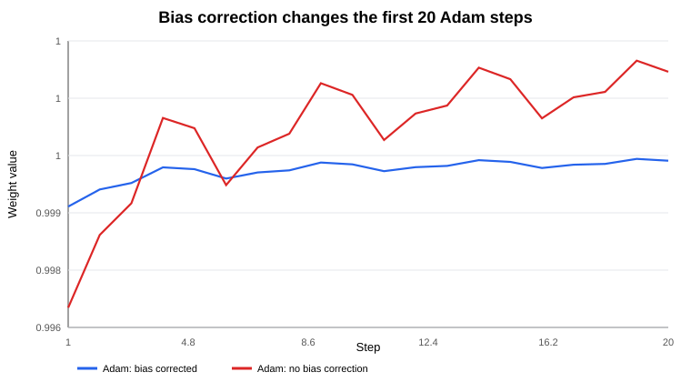
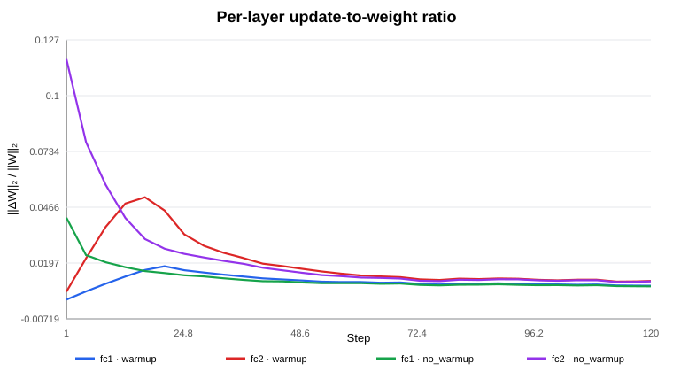
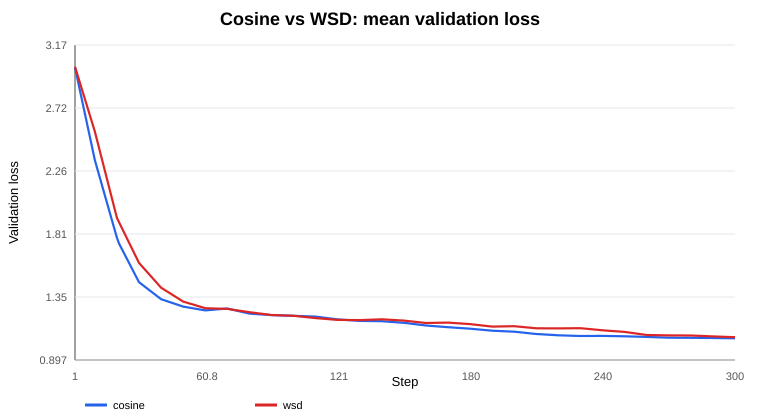
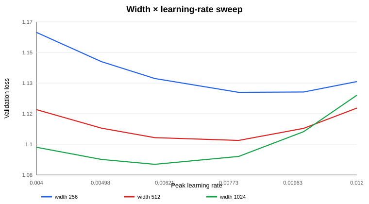

# Session 11 — Optimizers & Learning-Rate Schedules

> **A controlled optimizer study: derive it, instrument it, ablate it, tune it fairly, and state only what the evidence supports.**

This project studies Adam, bias correction, warmup, cosine vs WSD scheduling, and learning-rate scaling. Every comparison controls initialization, data order, training horizon, and tuning protocol. Evidence summaries and figures are committed under `artifacts/`.

## Results at a glance

| Question | Result |
|---|---|
| Adam by hand vs PyTorch | max absolute error **4.12e-17** |
| Bias correction becomes sustainably <1% | theory **3916**, measured updates **3925** |
| Warmup stops directly changing LR | after **step 20**; step **21** is the first flat-LR step |
| Residual warmup effect on layer U/W | sustainably <5% at **step 87** |
| Cosine vs WSD at unexpected step 200 | **keep cosine**: 1.1010 ± 0.0026 vs 1.1409 ± 0.0027 validation loss |
| LR minima at widths 256 / 512 / 1024 | **0.008684 / 0.006952 / 0.005931** |
| First LR to try at width 4096 | **0.004007**; bootstrap 95% CI **[0.003480, 0.004522]** |
| Width-scaling fit | **R² = 0.9908**, exponent **-0.2751** |
| Causal Transformer replication | cosine also wins under its independently tuned settings |

---

## 1. Reproducibility and controls

Primary model: `64 → Linear(width) → GELU → Linear(20)`, trained on a deterministic nonlinear teacher-generated classification task. Default width is 512. Shared settings are AdamW, β₁=0.9, β₂=0.999, ε=1e-8, weight decay 0.01, batch size 128, and 20 warmup steps unless that variable is under study.

For controlled comparisons I hold fixed the dataset, initialization rule, mini-batch stream, optimizer family, weight decay, training horizon, and evaluation metric. Only the variable under study changes.

```bash
python -m pip install -r requirements.txt
python run_all.py
pytest -q
```

The automated suite contains **10 tests**, including Adam agreement, scheduler endpoints, shared warmup behavior, causal masking, evidence-link integrity, and disjoint schedule tuning/evaluation seeds.

---

## 2. Reproduce Adam by hand

Setup:

```text
w₀ = 1.0
g = [0.10, -0.20, 0.05, -0.10, 0.15]
η = 0.001, β₁ = 0.9, β₂ = 0.999, ε = 1e-8
```

Equations:

$$m_t=\beta_1m_{t-1}+(1-\beta_1)g_t$$

$$v_t=\beta_2v_{t-1}+(1-\beta_2)g_t^2$$

$$\hat m_t=\frac{m_t}{1-\beta_1^t},\qquad \hat v_t=\frac{v_t}{1-\beta_2^t}$$

$$\Delta w_t=-\eta\frac{\hat m_t}{\sqrt{\hat v_t}+\epsilon},\qquad w_t=w_{t-1}+\Delta w_t$$

| t | g | m | v | m̂ | v̂ | Δw | weight |
|---:|---:|---:|---:|---:|---:|---:|---:|
| 1 | +0.10 | 0.010000 | 0.00001000 | 0.100000 | 0.010000 | -0.00100000 | 0.99900000 |
| 2 | -0.20 | -0.011000 | 0.00004999 | -0.057895 | 0.025008 | +0.00036610 | 0.99936610 |
| 3 | +0.05 | -0.004900 | 0.00005244 | -0.018081 | 0.017497 | +0.00013669 | 0.99950279 |
| 4 | -0.10 | -0.014410 | 0.00006239 | -0.041902 | 0.015620 | +0.00033526 | 0.99983806 |
| 5 | +0.15 | 0.002031 | 0.00008483 | 0.004960 | 0.016999 | -0.00003804 | 0.99980002 |

For step 1, `m₁=0.01`, `v₁=0.00001`, `m̂₁=0.1`, `v̂₁=0.01`, and `Δw₁≈-0.001`. The experiment then inspects PyTorch's `exp_avg`, `exp_avg_sq`, reconstructed bias-corrected moments, and actual parameter delta after every update.

**Maximum absolute disagreement: `4.1220e-17`.**

Evidence: [`artifacts/01_adam_verification.csv`](artifacts/01_adam_verification.csv)

---

## 3. Disable bias correction

The custom `AdamNoBiasCorrection` keeps the same EMA recurrences but uses raw `m_t` and `v_t` rather than `m̂_t` and `v̂_t`.

Ignoring ε, the analytical scale difference is governed by

$$R_t=\frac{\sqrt{1-\beta_2^t}}{1-\beta_1^t}.$$

I define “stops mattering” as remaining below **1% for 20 consecutive steps**. For actual optimizer updates I measure

$$D_t=\frac{|\Delta w_t^{BC}-\Delta w_t^{NoBC}|}{|\Delta w_t^{BC}|+\epsilon}.$$

Results:

- analytical multiplier: sustainably <1% at **step 3916**;
- measured update difference on the controlled gradient stream: sustainably <1% at **step 3925**.



Evidence: `02_bias_correction_first20.csv`, `02_bias_correction_threshold_evidence.csv`.

---

## 4. Update-to-weight ratio and warmup

For each parameter tensor:

$$R_t=\frac{\|\Delta W_t\|_2}{\|W_t\|_2+\epsilon}.$$

Layer-level ratios combine tensor norms before division, avoiding a naive average across differently sized tensors.

To distinguish the schedule boundary from its residual training effect, I run a paired control:

- treatment: 20-step linear warmup;
- control: peak LR from step 1;
- identical initialization, batches, optimizer, and model.

For each layer:

$$E_l(t)=\frac{|R_l^{warmup}(t)-R_l^{control}(t)|}{R_l^{control}(t)+\epsilon}.$$

I call the residual effect negligible when every layer remains within **5% for five consecutive steps**.

Results:

- last direct warmup LR increase: **step 20**;
- first step with no direct warmup LR change: **step 21**;
- first sustained all-layer paired U/W gap below 5%: **step 87**.

At step 20 the paired gaps are still about 22.9% for `fc1` and 77.0% for `fc2`; by step 87 they are about 4.95% and 3.14%.



Evidence: `03_warmup_causal_summary.csv` plus the experiment source, which regenerates the full parameter- and layer-level logs.

---

## 5. Cosine vs WSD — fair interruption experiment

The planned horizon is 300 steps, so the unexpected step-200 interruption is **not used for tuning**.

Protocol:

1. Tune both schedules at planned step 300 on seeds **37, 38, 39**.
2. Tune cosine peak LR independently.
3. Tune WSD peak LR **and decay start** independently.
4. Freeze the selected hyperparameters.
5. Evaluate step 200 and step 300 on disjoint seeds **41, 42, 43**.

Search spaces:

```text
Cosine LR: 0.0035, 0.0045, 0.0055, 0.0065, 0.0075
WSD LR:    0.0025, 0.0035, 0.0045, 0.0055
WSD decay start: 210, 240, 270
```

Selected configuration: cosine peak LR **0.0055**; WSD peak LR **0.0035**, decay start **210**.

| Schedule | Step | Validation loss mean ± SD |
|---|---:|---:|
| Cosine | 200 | **1.1010 ± 0.0026** |
| WSD | 200 | 1.1409 ± 0.0027 |
| Cosine | 300 | **1.0534 ± 0.0055** |
| WSD | 300 | 1.0614 ± 0.0094 |

At step 200, the paired difference `WSD − cosine` is approximately **0.0399 ± 0.0013** across the evaluation seeds.

**Checkpoint decision: keep cosine at step 200.**



Evidence: `04_schedule_tuning.csv`, `04_schedule_tuning_summary.csv`, `04_frozen_multiseed_summary.csv`, `04_paired_seed_differences.csv`.

---

## 6. Learning-rate scaling across width

A coarse search locates the LR basin; a refined search evaluates each point over seeds 41–43.

```text
Coarse: 0.0005, 0.001, 0.002, 0.004, 0.008, 0.016, 0.032
Refined: 0.004, 0.005, 0.006, 0.008, 0.010, 0.012
```

| Width | Best sampled LR | Log-LR quadratic basin estimate |
|---:|---:|---:|
| 256 | 0.008 | **0.008684** |
| 512 | 0.008 | **0.006952** |
| 1024 | 0.006 | **0.005931** |



Fitting

$$\log \eta^*=\log C+\alpha\log d$$

gives `α=-0.2751`, `R²=0.9908`, and

$$\boxed{\eta^*_{4096}\approx0.004007}.$$

A 5,000-resample cluster bootstrap over whole seed-level LR curves gives a pre-confirmation 95% interval of **[0.003480, 0.004522]**.

I then test width 4096 on new seeds 44–46 using a narrow bracket that was not used in the fit:

| LR | Validation loss mean ± SD |
|---:|---:|
| 0.0035 | 1.0814 ± 0.0042 |
| **0.0040** | **1.0812 ± 0.0048** |
| 0.0045 | 1.0829 ± 0.0053 |

**Recommendation:** start at **0.0040**. Confidence is moderate-to-high that the optimum lies near 0.0040 in this benchmark, but the three confirmation seeds do not establish that 0.0040 is uniquely better than 0.0035. External confidence is lower because the task is synthetic and the scaling law is fit from only three widths.

Evidence: `05_width_lr_fine_all_seeds.csv`, `05_width_lr_minima.csv`, `05_width_lr_bootstrap_summary.csv`, `05_width4096_confirmation_summary.csv`.

---

## 7. Causal Transformer replication

To test whether the scheduler conclusion survives an architecture change, I repeat the planned-horizon protocol on a tiny causal Transformer: one block, model dimension 16, two heads, vocabulary 32, sequence length 16, next-token cross-entropy.

The synthetic language obeys

$$x_t=(x_{t-1}+1)\bmod 32.$$

Both schedules are tuned at step 300 over LR values `0.10, 0.20, 0.40, 0.80`; WSD also tests decay starts 210 and 240. The selected values are cosine **0.40** and WSD **0.20** with decay start 210.

| Schedule | Step 200 validation | Step 300 validation |
|---|---:|---:|
| Cosine | **0.000974 ± 0.000438** | **0.001063 ± 0.000367** |
| WSD | 0.001482 ± 0.000093 | 0.001491 ± 0.000095 |

The result is deliberately scoped: under this architecture, task, optimizer, horizon, and tuning protocol, cosine outperformed WSD. It is not evidence of universal scheduler superiority.

---

## 8. Threats to validity

- The primary task is synthetic; absolute losses do not transfer to language-model pretraining.
- The width law is inferred from only 256, 512, and 1024 before the separate 4096 confirmation.
- The seed budget is finite: three tuning and three evaluation seeds for the primary scheduler comparison; one tuning and three evaluation seeds for the Transformer replication.
- Scheduler experiments use AdamW; interactions may differ with another optimizer.
- The 1% bias-correction and 5% warmup thresholds are declared operational definitions, not universal constants.
- WSD has additional design choices beyond peak LR and decay start.

---

## 9. Repository map

```text
era-v5-session11-optimizer-lab/
├── README.md
├── requirements.txt
├── Makefile
├── run_all.py
├── src/
│   ├── config.py
│   ├── data.py
│   ├── metrics.py
│   ├── model.py
│   ├── optimizers.py
│   ├── schedules.py
│   ├── tiny_transformer.py
│   └── utils.py
├── experiments/
│   ├── exp01_adam_by_hand.py
│   ├── exp02_bias_correction.py
│   ├── exp03_update_weight_ratio.py
│   ├── exp04_cosine_vs_wsd.py
│   ├── exp05_width_lr_sweep.py
│   └── exp06_tiny_transformer_replication.py
├── notebooks/session11_assignment.ipynb
├── tests/test_assignment.py
└── artifacts/
```

## 10. Key takeaways

1. Adam's zero-initialized moment estimates need bias correction, and β₂=0.999 makes the transient surprisingly long under a strict materiality threshold.
2. Warmup has two endings: the LR ramp ends at step 20, while its causal signature in the optimizer trajectory persists longer.
3. An interruption experiment should be tuned for the planned horizon, not for the interruption one later evaluates.
4. In this parameterization the best LR decreases with width approximately as `width^-0.275`.
5. Scheduler rankings are conditional on model, task, optimizer, horizon, and tuning protocol.

## References

- Diederik P. Kingma & Jimmy Ba, **Adam: A Method for Stochastic Optimization**, arXiv:1412.6980 / ICLR 2015: https://arxiv.org/abs/1412.6980
- Kaiyue Wen et al., **Understanding Warmup-Stable-Decay Learning Rates: A River Valley Loss Landscape Perspective**, arXiv:2410.05192: https://arxiv.org/abs/2410.05192

---

### Final answer sheet

```text
Adam manual-vs-PyTorch max error : 4.12e-17
Bias correction <1% theory       : step 3916
Bias correction <1% measured     : step 3925
Direct warmup LR ends            : after step 20
Residual warmup U/W <5% sustained: step 87
Cosine peak LR                   : 0.0055
WSD peak LR / decay start        : 0.0035 / 210
Step-200 checkpoint              : COSINE
Cosine / WSD val @200            : 1.1010 ± 0.0026 / 1.1409 ± 0.0027
LR* width 256 / 512 / 1024       : 0.008684 / 0.006952 / 0.005931
Predicted LR* width 4096         : 0.004007
4096 bootstrap 95% CI            : [0.003480, 0.004522]
4096 held-out best bracket point : 0.0040
Width-scaling fit R²             : 0.9908
Transformer step-200 winner      : COSINE
Automated tests                  : 10 passing
```
